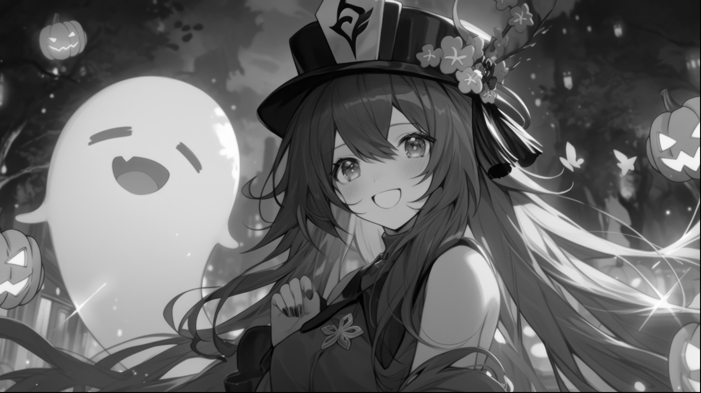
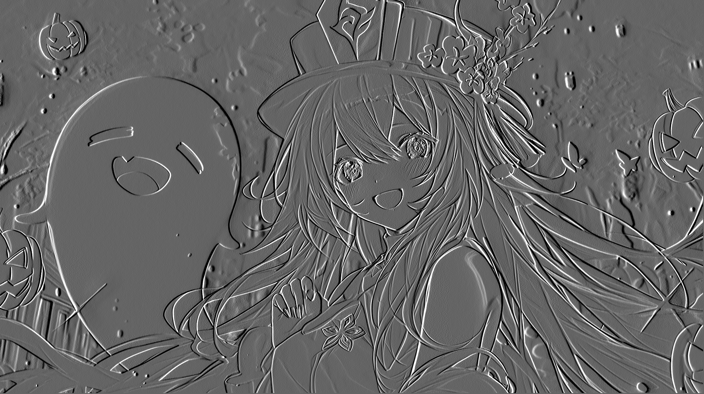
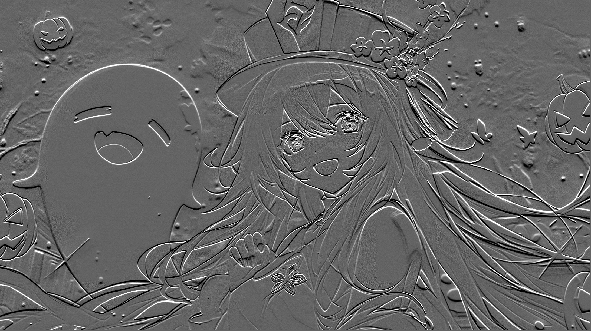

# HHS CS Workshop: Convolutions
Learn about convolutions through running convolutions on images with different kernels.  
**All of the code, instructions, and slides were made by [Aayush Gaywala](https://github.com/cqtqlyst).** (All I did was some minor bug fixes :skull:)  
[Workshop slides](https://github.com/BaroqueObama/hhs-ws-convolutions/blob/main/GM8.pdf) (created by Aayush)  
## Code:
Written by Aayush Gaywala.
- Convert image to grayscale.
- Create a kernel with a numpy array.
- Run convolutions with nested for loop.
## Example:
### Images:
|                 Original                |                   Grayscale                   |
|:---------------------------------------:|:---------------------------------------------:|
|  |  |  

|                  Blur                  |                   Sharpen                   |
|:-----------------------------------------:|:---------------------------------------------:|
|  |  |  

|                   Vertical Edge                  |                   Horizontal Edge                   |
|:------------------------------------------------:|:---------------------------------------------------:|
|  |  |  

### Kernels:
**Blur:**  
```
[[1, 1, 1],
 [1, 1, 1],
 [1, 1, 1]] * 1/9
```
**Sharpen:**  
```
[[0, -1, 0],
 [-1, 5, -1],
 [0, -1, 0]]
```
**Vertical Edge:**  
```
[[-1, 0, 1],
 [-1, 0, 1],
 [-1, 0, 1]]
```
**Horizontal Edge:**  
```
[[-1, -1, -1],
 [0, 0, 0],
 [1, 1, 1]]
```
